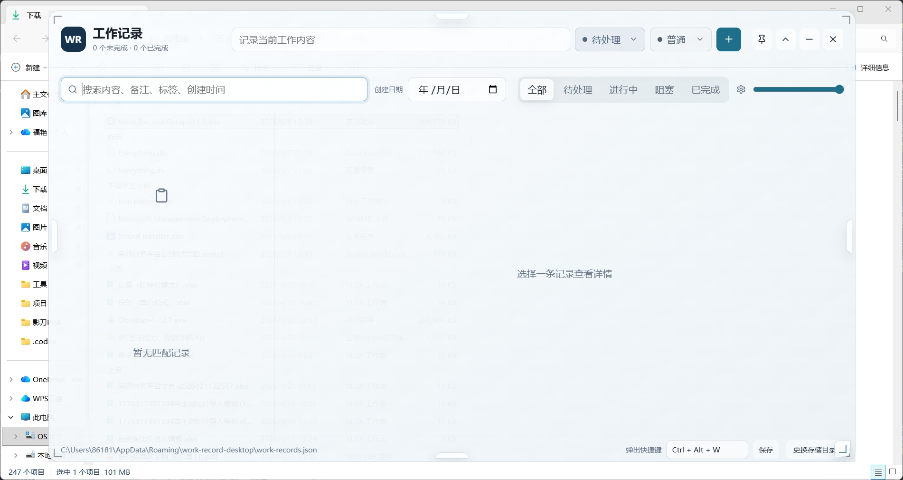

# Work Record Desktop

一个本地优先的 Electron 桌面工作记录应用。它以半透明悬浮窗的形式固定在桌面上方，用来快速记录工作内容、任务状态、笔记、网址和账号密码信息。

## 样例展示

> 可在此处继续替换或补充应用截图。



<!--
更多截图占位：


-->

## 主要功能

- 桌面悬浮窗：支持置顶显示、收起/展开、最小化、关闭。
- 快速新增记录：顶部输入工作内容，选择任务状态和优先级后快速创建。
- 任务状态管理：支持待处理、进行中、阻塞、已完成；选择已完成时自动补充完成时间。
- 优先级管理：支持低、普通、高、紧急，并用不同颜色区分。
- 本地记录存储：数据保存在本地 JSON 文件中，默认位于 Electron `userData` 目录。
- 自定义存储目录：可在界面底部切换记录文件保存位置。
- 创建时间展示：记录列表按创建时间倒序展示，并显示创建时间。
- 创建日期筛选：支持按创建日期过滤记录。
- 搜索：支持搜索内容、备注、标签和创建时间。
- 笔记附件：每条记录可添加普通笔记、网址、账号密码附件。
- 密码展示控制：密码默认遮罩，可手动显示或复制。
- 透明度调节：底部滑杆可调整窗口透明度。
- 自定义弹出快捷键：点击快捷键输入框后直接按键盘组合即可保存。
- 快捷键呼出/最小化：窗口隐藏或被挡住时按快捷键呼出；窗口在前台时再次按快捷键最小化。
- 窗口缩放：支持通过边缘和角落把手拖拽调整窗口大小。

## 本地存储说明

应用会维护一个 `work-records.json` 文件，保存工作记录、附件和本地设置。

默认路径示例：

```text
C:\Users\<用户名>\AppData\Roaming\work-record-desktop\work-records.json
```

也可以在应用底部点击“更换存储目录”，把记录文件保存到自定义目录。

> 注意：当前版本按需求采用本地明文 JSON 存储。账号密码附件在文件中不会加密，只在界面上默认遮罩显示。不要把真实高敏密码保存到不受保护的电脑或同步盘中。

## 开发运行

安装依赖：

```powershell
npm.cmd install
```

启动开发版：

```powershell
npm.cmd run dev
```

浏览器预览地址：

```text
http://127.0.0.1:5173/
```

## 打包 Windows 安装包

```powershell
npm.cmd run dist
```

打包产物会输出到：

```text
release/
```

安装包示例：

```text
release/Work Record-Setup-0.1.0.exe
```

## 项目结构

```text
.
├─ electron/          # Electron 主进程和 preload
├─ src/               # React 前端界面
├─ build/             # 应用图标等打包资源
├─ docs/images/       # README 截图资源
├─ dist/              # Vite 构建产物，不提交
├─ release/           # exe 打包产物，不提交
├─ package.json
└─ vite.config.js
```

## 技术栈

- Electron
- React
- Vite
- electron-builder
- lucide-react

## 许可证

当前项目暂未指定许可证。
