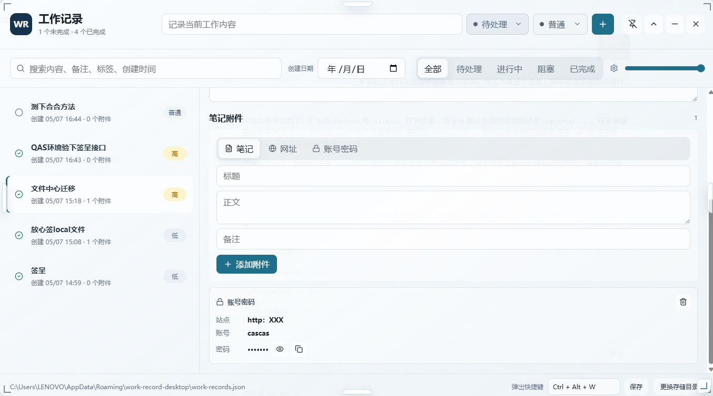
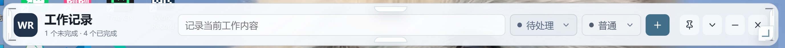

# Work Record Desktop

一个基于 Electron + Vite + React 的桌面工作记录应用。它以半透明悬浮窗口固定在桌面上方，方便快速记录工作内容、任务状态、笔记、网址和账号密码类附件。

## 样例展示

> 截图文件放在 `docs/images/` 目录，可按需继续替换或补充。

### 完整工作台


### 记录详情与附件



### 收起悬浮栏



<!--
更多截图占位：


-->

## 主要功能

- 桌面悬浮窗口：支持置顶显示、收起/展开、最小化、关闭。
- 快速新增记录：顶部输入工作内容，选择任务状态和优先级后快速创建。
- 任务状态管理：支持待处理、进行中、阻塞、已完成；选择已完成时会自动补充完成时间。
- 优先级管理：支持低、普通、高、紧急，并用不同颜色区分。
- 创建时间排序：记录列表按创建时间倒序展示。
- 创建日期筛选：支持按创建日期过滤记录。
- 搜索：支持搜索内容、备注、标签和创建时间。
- 笔记附件：每条记录可添加普通笔记、网站地址、账号密码附件。
- 密码展示控制：密码默认遮罩，可手动显示或复制。
- 透明度调节：底部滑杆可即时调节窗口透明度。
- 自定义弹出快捷键：点击快捷键输入框后，直接按键盘组合即可保存。
- 快捷键呼出/最小化：窗口隐藏或被遮挡时按快捷键呼出；窗口在前台时再次按快捷键最小化。
- 窗口缩放：支持通过边缘和角落把手拖拽调整窗口大小。
- 本地 JSON 兜底：未登录 Supabase 时仍可用本地 JSON 保存记录。
- Supabase 云端存储：配置 Supabase 后，可使用邮箱密码登录，将记录保存到云端 `work_records` 表。
- 本地数据迁移：登录后可将本地 JSON 记录导入当前 Supabase 账号。

## Supabase 配置

1. 在 Supabase 项目中打开 SQL Editor。
2. 执行 [docs/supabase-schema.sql](docs/supabase-schema.sql)。
3. 当前项目已默认配置为 `work-record`：
   `https://mwuvkyjynsvsfcqfyeks.supabase.co`
4. 在应用底部点击 `Supabase 登录`。
5. 填入邮箱和密码，点击 `登录` 或 `注册`。

执行 SQL 后会创建 `public.work_records` 表，并启用 Row Level Security。每个用户只能读取、写入、更新和删除自己的记录。
同时会创建：

- `public.user_profiles`：同步注册用户的 `user_id`、邮箱、最后登录时间。
- `public.user_settings`：同步每个用户的透明度、置顶、收起状态、弹出快捷键和存储模式。

默认 Supabase 区域：`ap-southeast-1`，也就是 Singapore。

## 存储说明

应用现在支持两种存储方式：

- 云端模式：登录 Supabase 后，记录写入 Supabase。
- 本地模式：未配置或未登录 Supabase 时，记录写入本地 `work-records.json`。

默认本地路径示例：

```text
C:\Users\<用户名>\AppData\Roaming\work-record-desktop\work-records.json
```

也可以在应用底部点击 `更换本地目录`，把本地记录文件保存到自定义目录。

> 注意：账号密码类附件会按当前实现明文保存到 Supabase 或本地 JSON；界面只做默认遮罩展示，不提供加密保护。不要保存高敏感密码。

## 开发运行

安装依赖：

```powershell
npm.cmd install
```

启动开发版：

```powershell
npm.cmd run dev
```

浏览器预览地址：

```text
http://127.0.0.1:5173/
```

## 打包 Windows 安装包

```powershell
npm.cmd run dist
```

打包产物会输出到：

```text
release/
```

安装包示例：

```text
release/Work Record-Setup-0.1.0.exe
```

## 项目结构

```text
.
├─ electron/          # Electron 主进程和 preload
├─ src/               # React 前端界面
├─ build/             # 应用图标等打包资源
├─ docs/              # SQL、截图等文档资源
├─ docs/images/       # README 截图资源
├─ dist/              # Vite 构建产物，不提交
├─ release/           # exe 打包产物，不提交
├─ package.json
└─ vite.config.js
```

## 技术栈

- Electron
- React
- Vite
- Supabase
- electron-builder
- lucide-react

## 许可

当前项目暂未指定许可证。
